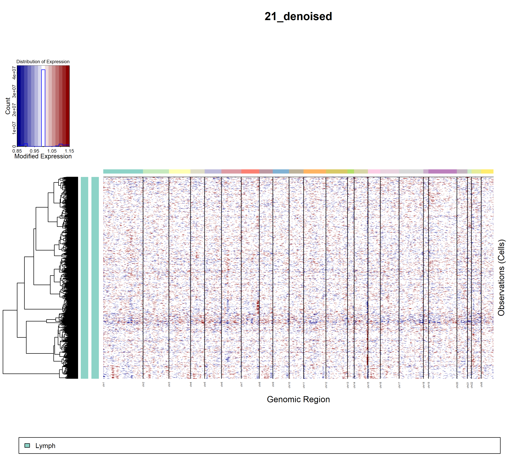

# Setup

``` r
library(tidyverse)
library(SpatialInferCNV)
```

    ## Warning: replacing previous import 'phylogram::as.phylo' by 'ape::as.phylo' when
    ## loading 'SpatialInferCNV'

# Importing Count Data

Just to make things a little easier for the user, we start by creating
an empty working directory so that all downloaded files are organized in
one place.

``` r
dir.create("siCNV_Figure4a")
setwd("siCNV_Figure4a")
```

This code chunk imports the .h5 files a default processed output from
[10x Genomics cell ranger pipeline
documentation](https://support.10xgenomics.com/single-cell-gene-expression/software/pipelines/latest/output/molecule_info),
and appends a section label to the barcode.

We use the function ImportCountData(), which requires a section label,
and a path to the corresponding .h5 file.

``` r
download.file("https://cf.10xgenomics.com/samples/spatial-exp/1.1.0/V1_Human_Lymph_Node/V1_Human_Lymph_Node_filtered_feature_bc_matrix.h5", "./V1_Human_Lymph_Node_filtered_feature_bc_matrix.h5", mode = "wb")

Lymph_ENSBMLID_Counts <- ImportCountData("LN10X", "./V1_Human_Lymph_Node_filtered_feature_bc_matrix.h5")

Lymph_Annotations <- Lymph_ENSBMLID_Counts %>%
                          select(Barcode)
Lymph_Annotations$Histology <- "Lymph"
```

# QC, and Merging Count and Annotation Data

We then join the annotations with the count data, to select only spots
that are to be analyzed. This step also includes a bare minimum QC
thresholding step of allowing only Visium spots with 500 counts or more
to be included in the analysis

``` r
Lymph_Joined_Counts <- MergingCountAndAnnotationData("LN10X",Lymph_Annotations, Lymph_ENSBMLID_Counts)

rm(Lymph_ENSBMLID_Counts)
```

# Merging all count data into one object

We then join all of the selected count data together into a final
dataframe, which is then output as a .tsv file (1 of 3 required inputs
for inferCNV), as well as a revised annotation file (takes into account
only those of interest that remain after the QC step) as another .tsv
file (2 of 3 required inputs from inferCNV)

``` r
Counts_joined <- Lymph_Joined_Counts

Counts_joined <- Counts_joined %>% replace(., is.na(.), 0)
Counts_joined <- Counts_joined %>% column_to_rownames(., var = "Genes")

write.table(Counts_joined, "10xLymph_Counts.tsv", sep = "\t")

LymphFinalAnnotations <- FinalAnnotations(Lymph_Annotations, Counts_joined)

write.table(LymphFinalAnnotations, "10xLymph_Annotations.tsv", 
            sep = "\t",
            quote = FALSE, 
            col.names = FALSE, 
            row.names = FALSE)
```

# Confirming that the files are formatted correctly to create an inferCNV object

This code then creates an inferCNV object from the 2 previously created
files, as well as from a gene position file, which maps ENSMBLIDs to
genomic loci. This file has been provided at
/SpatialInferCNV_Dev/SpatialInferCNV/FigureScripts/Figure 4/Figure4a_LN,
but if you’d like to build one youself, please see [the InferCNV
documentation on their
wiki](https://github.com/broadinstitute/inferCNV/wiki/instructions-create-genome-position-file).

``` r
Lymph10X_unsupervised <- infercnv::CreateInfercnvObject(raw_counts_matrix="10xLymph_Counts.tsv", 
                                               gene_order_file="./siCNV_GeneOrderFile.tsv",
                                               annotations_file="10xLymph_Annotations.tsv",
                                               delim="\t",
                                               ref_group_names=NULL,
                                               chr_exclude = c("chrM"))
```

# Running InferCNV (Unsupervised)

If the above steps were performed correctly, then there should be no
errors from the previous step.

Warning! This step is quite computationally intensive. Consider using a
high performance cluster for timely analyses instead of running it on a
local computer.

``` r
Lymph10X_unsupervised = infercnv::run(Lymph10X_unsupervised,
                                              cutoff=0.1,
                                              out_dir="./Fig4_LN/Outputs/", 
                                              num_threads = 20,
                                              cluster_by_groups=FALSE, 
                                              denoise=TRUE,
                                              HMM=FALSE)
```

# Final output

The final desired output is the infercnv.21_denoised.png file.


