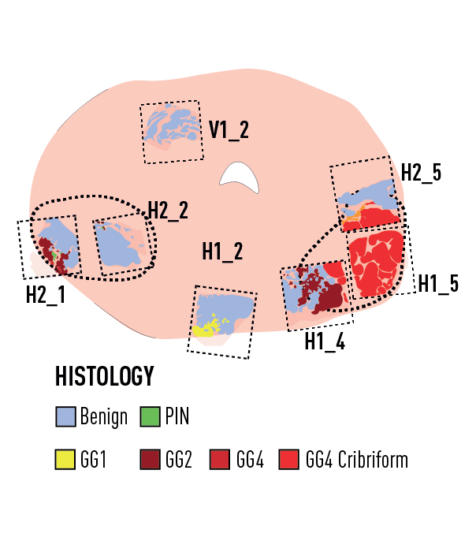
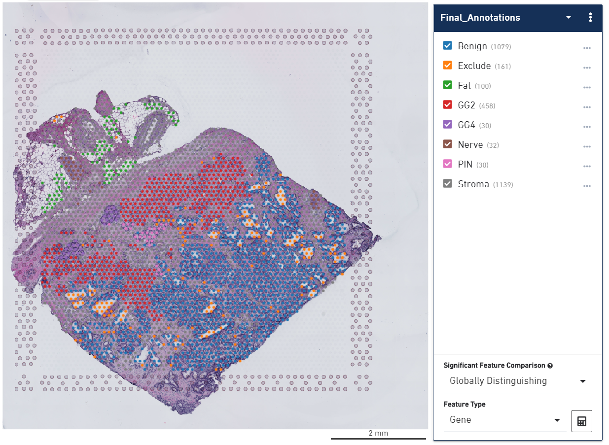
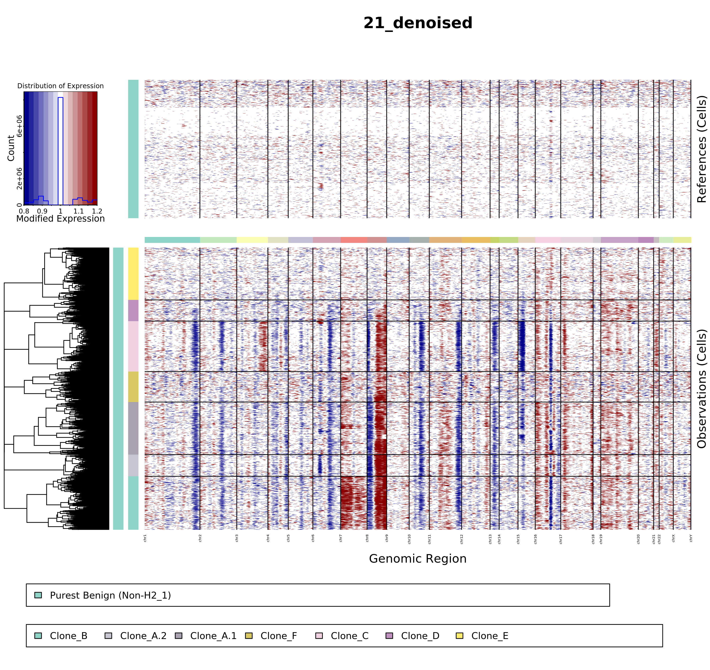
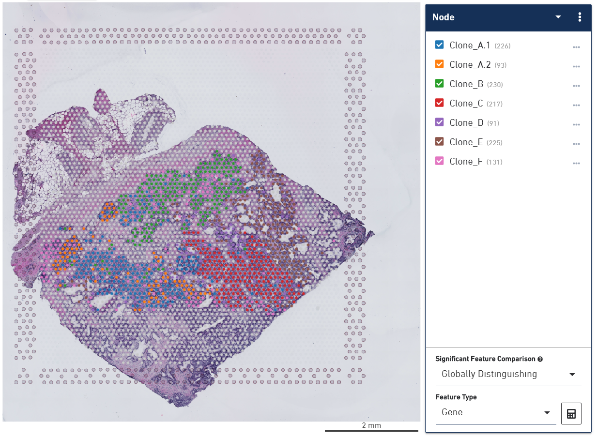
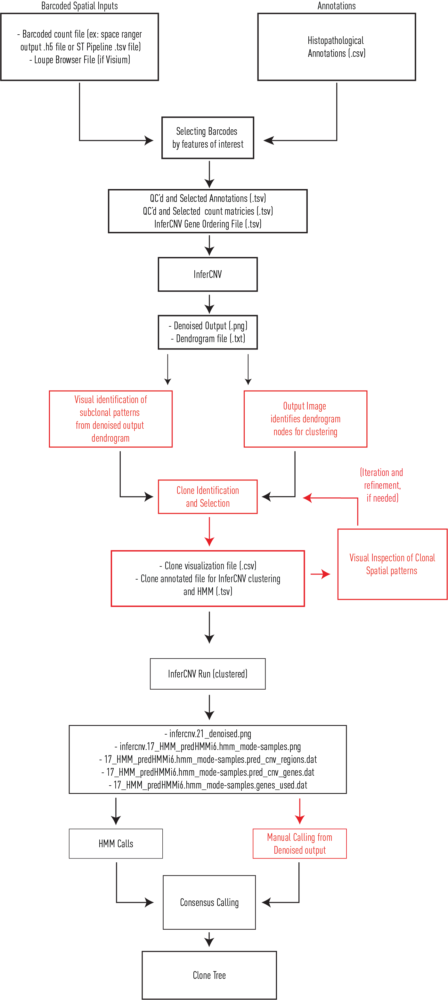
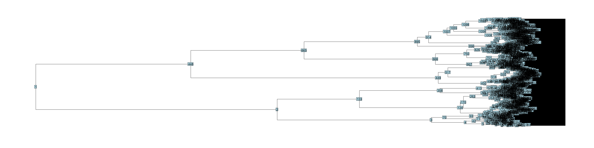
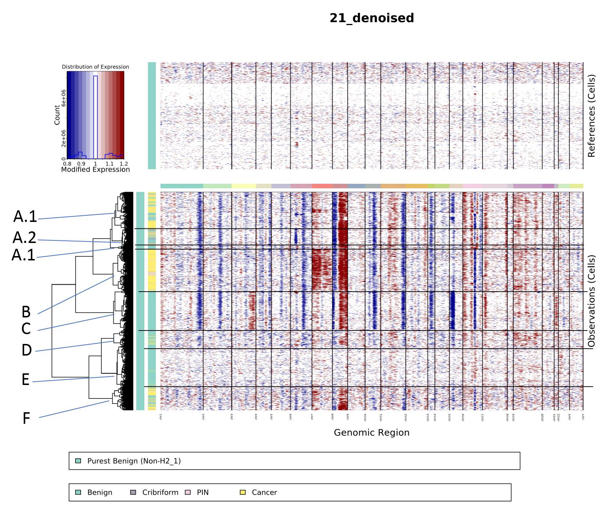
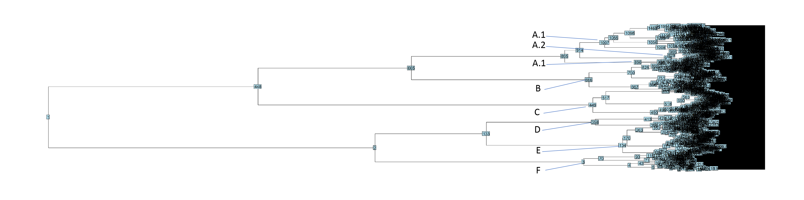
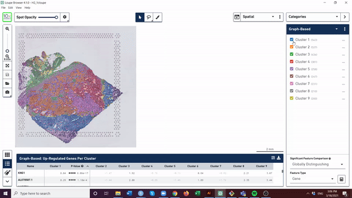
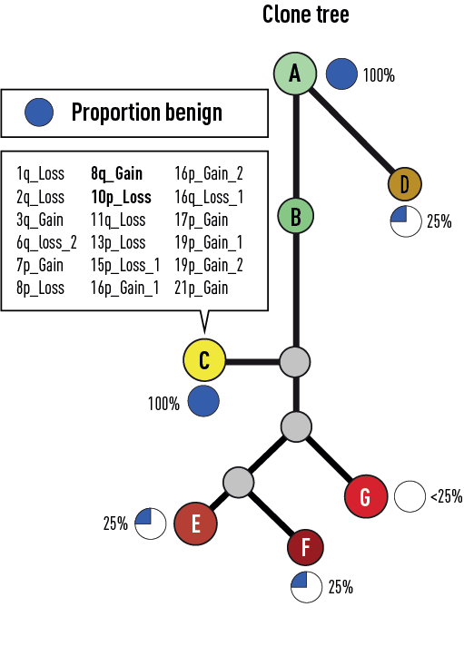

Introduction
============

In this analysis, we want to analyze all of the luminal epithelial cells
from a given section (Section H2\_1), while using benign luminal
epithelial cells, with little-to-no inferred copy number variation from
all other sections (Sections H1\_5, H2\_2, H1\_2, H2\_5, H1\_4, and
V1\_2) from the same patient. We will write a separate tutorial of how
to identify and generate this file, but for this walkthrough, we have
provide the file we used in these analyses. Go to
[BenignRefs](BenignRefs.md)

This code was tested using R version 4.0.1 (2020-06-06), a Windows 10
Computer, 16GB RAM, and 4 CPUs (2.5 GHz). For timely data-analyses of
datasets comprising 2 or more Visium sections, consider use of a high
performance cluster. In our project, such analyses were ran on the
[BMRC](https://www.medsci.ox.ac.uk/divisional-services/support-services-1/bmrc/cluster-usage),
with 10-20 CPUs, each 1.6 GHz and 16GB ram.

<p align="center">
  
</p>







Setup
=====

``` r
#install.packages("ape")
#install.packages("devtools")
#install.packages("remotes")
#install.packages("phylogram")
#install.packages("tidyverse")

library(remotes)
#remotes::install_github(repo = 'satijalab/seurat', ref = 'develop')
library(devtools)
library(ape)
library(phylogram)
library(tidyverse)
```

``` r
#AUTH = '87a674f0a1c03d8ccc57bf23c5303695ec30b7ee'

#install_github('aerickso/SpatialInferCNV',
#                         auth_token = AUTH)
library(SpatialInferCNV)
```



Defining (Benign) Reference Set
===============================

This first code chunk takes “purest benigns” (see other walkthrough),
eg, histologically benign luminal epithelial cells, which have
little-to-no inferred copy number changes, and extracts those that are
not in the section of interest

``` r
PurestBenigns_All <- read.csv("./Data/VisiumData/Processed/Consensus_PurestBenigns_18112020.csv")

PurestBenigns_All$section <- substr(PurestBenigns_All$Barcode, 1, 4) 

Not_H2_1_PurestBenigns <- PurestBenigns_All %>% filter(section != "H2_1")

rm(PurestBenigns_All)
Not_H2_1_PurestBenigns <- Not_H2_1_PurestBenigns %>% select(Barcode, Histology)
Not_H2_1_PurestBenigns$Histology <- "Purest Benign (Non-H2_1)"
```

Defining Observation Set
========================

We then import the consensus pathology calls for the section of interest
(H2\_1), and select only cells of interest, in this case, luminal
epithelial cells such as benign, PIN, and prostate cancer (GG2, GG4)

We then join these with the reference set “Purest Benign (Non-H2\_1)”
for a final set of joined annotations

``` r
Consensus_H2_1_Histology <- ImportHistologicalAnnotations("H2_1", "./Data/HistologicalAnnotations/H2_1_Consensus_Version_1.1_CorrectedCancerAnnotations_20112020.csv")
                                                          
H2_1_Joined_Annotations_filtered <- Consensus_H2_1_Histology %>%
                                                    filter(str_detect(Histology, "Benign|GG2|PIN|GG4"))

table(H2_1_Joined_Annotations_filtered$Histology)

MergedAll <- rbind(H2_1_Joined_Annotations_filtered, Not_H2_1_PurestBenigns)
```

Importing Count Data
====================

This code chunk imports the .h5 files a default processed output from
[10x Genomics cell ranger pipeline
documentation](https://support.10xgenomics.com/single-cell-gene-expression/software/pipelines/latest/output/molecule_info),
and appends a section label to the barcode.

We use the function ImportCountData(), which requires a section label,
and a path to the corresponding .h5 file.

``` r
H2_1_ENSBMLID_Counts <- ImportCountData("H2_1", "./Data/VisiumData/Raw/H2_1/filtered_feature_bc_matrix.h5")
H1_5_ENSBMLID_Counts <- ImportCountData("H1_5", "./Data/VisiumData/Raw/H1_5/filtered_feature_bc_matrix.h5")
H2_2_ENSBMLID_Counts <- ImportCountData("H2_2", "./Data/VisiumData/Raw/H2_2/filtered_feature_bc_matrix.h5")
H1_2_ENSBMLID_Counts <- ImportCountData("H1_2", "./Data/VisiumData/Raw/H1_2/filtered_feature_bc_matrix.h5")
H2_5_ENSBMLID_Counts <- ImportCountData("H2_5", "./Data/VisiumData/Raw/H2_5/filtered_feature_bc_matrix.h5")
H1_4_ENSBMLID_Counts <- ImportCountData("H1_4", "./Data/VisiumData/Raw/H1_4/filtered_feature_bc_matrix.h5")
V1_2_ENSBMLID_Counts <- ImportCountData("V1_2", "./Data/VisiumData/Raw/V1_2/filtered_feature_bc_matrix.h5")
```

QC, and Merging Count and Annotation Data
=========================================

We then join the annotations with the count data, to select only spots
that are to be analyzed. This step also includes a bare minimum QC
thresholding step of allowing only Visium spots with 500 counts or more
to be included in the analysis

``` r
H2_1_Joined_Counts <- MergingCountAndAnnotationData("H2_1",MergedAll, H2_1_ENSBMLID_Counts)
H1_5_Joined_Counts <- MergingCountAndAnnotationData("H1_5",MergedAll, H1_5_ENSBMLID_Counts)
H2_2_Joined_Counts <- MergingCountAndAnnotationData("H2_2",MergedAll, H2_2_ENSBMLID_Counts)
H1_2_Joined_Counts <- MergingCountAndAnnotationData("H1_2",MergedAll, H1_2_ENSBMLID_Counts)
H2_5_Joined_Counts <- MergingCountAndAnnotationData("H2_5",MergedAll, H2_5_ENSBMLID_Counts)
H1_4_Joined_Counts <- MergingCountAndAnnotationData("H1_4",MergedAll, H1_4_ENSBMLID_Counts)
V1_2_Joined_Counts <- MergingCountAndAnnotationData("V1_2",MergedAll, V1_2_ENSBMLID_Counts)

rm(H2_1_ENSBMLID_Counts)
rm(H1_5_ENSBMLID_Counts)
rm(H2_2_ENSBMLID_Counts)
rm(H1_2_ENSBMLID_Counts)
rm(H2_5_ENSBMLID_Counts)
rm(H1_4_ENSBMLID_Counts)
rm(V1_2_ENSBMLID_Counts)
```

Merging all count data into one object
======================================

We then join all of the selected count data together into a final
dataframe, which is then output as a .tsv file (1 of 3 required inputs
for inferCNV), as well as a revised annotation file (takes into account
only those of interest that remain after the QC step) as another .tsv
file (2 of 3 required inputs from inferCNV)

``` r
#setwd("C:/Users/erick/Dropbox/GitHub Repo/SpatialInferCNV_17032021")
Counts_joined <- H2_1_Joined_Counts %>% full_join(H1_5_Joined_Counts, by = "Genes")
Counts_joined <- Counts_joined %>% full_join(H2_2_Joined_Counts, by = "Genes")
Counts_joined <- Counts_joined %>% full_join(H1_2_Joined_Counts, by = "Genes")
Counts_joined <- Counts_joined %>% full_join(H2_5_Joined_Counts, by = "Genes")
Counts_joined <- Counts_joined %>% full_join(H1_4_Joined_Counts, by = "Genes")
Counts_joined <- Counts_joined %>% full_join(V1_2_Joined_Counts, by = "Genes")

rm(H2_1_Joined_Counts)
rm(H1_5_Joined_Counts)
rm(H2_2_Joined_Counts)
rm(H1_2_Joined_Counts)
rm(H2_5_Joined_Counts)
rm(H1_4_Joined_Counts)
rm(V1_2_Joined_Counts)

Counts_joined <- Counts_joined %>% replace(., is.na(.), 0)
Counts_joined <- Counts_joined %>% column_to_rownames(., var = "Genes")

write.table(Counts_joined, "CorrectedBenigns_Consensus_H2_1_ForClustering_Counts_19112020.tsv", sep = "\t")

Consensus_AllCancersandBenigns_ForClustering <- FinalAnnotations(MergedAll, Counts_joined)

write.table(Consensus_AllCancersandBenigns_ForClustering, "CorrectedBenigns_Consensus_H2_1_ForClustering_Annotations_19112020.tsv", 
            sep = "\t",
            quote = FALSE, 
            col.names = FALSE, 
            row.names = FALSE)
```

Confirming that the files are formatted correctly to create an inferCNV object
==============================================================================

This code then creates an inferCNV object from the 2 previously created
files, as well as from a gene position file, which maps ENSMBLIDs to
genomic loci. This file has been provided, but if you’d like to build
one youself, please see [the InferCNV documentation on their
wiki](https://github.com/broadinstitute/inferCNV/wiki/instructions-create-genome-position-file).

``` r
H2_1_ManualNodeSelection_infCNV <- infercnv::CreateInfercnvObject(raw_counts_matrix="./Data/InferCNV Files/ExampleInputs/CorrectedBenigns_Consensus_H2_1_ForClustering_Counts_19112020.tsv", 
                                               gene_order_file="./Data/InferCNV Files/ExampleInputs/gene_position_27072020.tsv",
                                               annotations_file="./Data/InferCNV Files/ExampleInputs/CorrectedBenigns_Consensus_H2_1_ForClustering_Annotations_19112020.tsv",
                                               delim="\t",
                                               ref_group_names="Purest Benign (Non-H2_1)",
                                               chr_exclude = c("chrM"))
```

Running InferCNV (Unsupervised)
===============================

If the above steps were performed correctly, then there should be no
errors from the previous step.

Warning! This step is quite computationally intensive. Consider using a
high performance cluster for timely analyses instead of running it on a
local computer.

``` r
H2_1_ManualNodeSelection_infCNV = infercnv::run(H2_1_ManualNodeSelection_infCNV,
                                              cutoff=0.1,
                                            out_dir="./Data/InferCNV Files/TestOutputs/Unsupervised", 
                                              num_threads = 18,
                                              cluster_by_groups=FALSE, 
                                              denoise=TRUE,
                                              HMM=FALSE)
```


InferCNV will output many files. We are primarily interested in the
final “infercnv.21\_denoised.png” file, as well as the text file
associated with the dendrogram associated with the hierarchical
clustering on the left hand side of the image
(infercnv.21\_denoised.observations\_dendrogram.txt).

Importing dendrogram
====================

Next, we want to import this dendrogram file.

``` r
Consensus_H2_1_for_clustering <- read.dendrogram(file = "./Data/InferCNV Files/ExampleOutputs/Unsupervised/infercnv.21_denoised.observations_dendrogram.txt")

Consensus_H2_1_for_clustering_phylo <- as.phylo(Consensus_H2_1_for_clustering)
```

Visualizing dendrogram node numbers
===================================

Next, we want to visualize the numbers associated with the nodes of
interest (clones). We output a large image file that allows us to
manually inspect which nodes should be selected as subclones.

``` r
my.subtrees = subtrees(Consensus_H2_1_for_clustering_phylo)  # subtrees() to subset

png("Consensus_H2_1_forclustering_phylo_09032021.png",width=10000,height=2500, res = 300)
plot(Consensus_H2_1_for_clustering_phylo,show.tip.label = FALSE)
nodelabels(text=1:Consensus_H2_1_for_clustering_phylo$Nnode,node=1:Consensus_H2_1_for_clustering_phylo$Nnode+Ntip(Consensus_H2_1_for_clustering_phylo))
dev.off()
```



Clone (node) selection (Manual Task outside of R in an image editor)
====================================================================

Next, view the output .png file, which provides a (albeit cluttered)
labeling of the dendrogram tree nodes. Manually select individual nodes
that correspond with a distinct subclonal grouping or signal, that will
be taken forward for re-clustering. This can be iteratively tweaked with
the next step + spatial visualization til optimal.





``` r
#A.2 - 915
#A.1 - 896 + 1007
#B - 666  
#C - 449  
#D - 358  
#E - 134 
#F - 3
```

Selecting clones in R
=====================

Next, after identifying the numerical nodes that correspond to
dendrogram branches that correspond with a given set of molecular
signals (aka, clones), we then manually select these nodes in R, apply a
label, then join them all together and output for visualization in Loupe
Browswer, as well as to take forward into supervised clustering (Hidden
Markov Models).

``` r
Node915 <- SelectingSubTreeData(my.subtrees, 915)
Node1007 <- SelectingSubTreeData(my.subtrees, 1007)
Node896 <- SelectingSubTreeData(my.subtrees, 896)
Node666 <- SelectingSubTreeData(my.subtrees, 666)
Node449 <- SelectingSubTreeData(my.subtrees, 449)
Node358 <- SelectingSubTreeData(my.subtrees, 358)
Node134 <- SelectingSubTreeData(my.subtrees, 134)
Node3 <- SelectingSubTreeData(my.subtrees, 3)

Merged <- rbind(Node1007, Node915)
Merged <- rbind(Merged, Node896)
Merged <- rbind(Merged, Node666)
Merged <- rbind(Merged, Node449)
Merged <- rbind(Merged, Node358)
Merged <- rbind(Merged, Node134)
Merged <- rbind(Merged, Node3)

table(Merged$Node)

Merged$Node <- ifelse(Merged$Node == "Node_1007", "Clone_A.1",
                     ifelse(Merged$Node == "Node_896" , "Clone_A.1",
                     ifelse(Merged$Node == "Node_915" , "Clone_A.2",
                     ifelse(Merged$Node == "Node_666" , "Clone_B",
                     ifelse(Merged$Node == "Node_449" , "Clone_C",
                     ifelse(Merged$Node == "Node_358" , "Clone_D",
                     ifelse(Merged$Node == "Node_134" , "Clone_E",
                     ifelse(Merged$Node == "Node_3" , "Clone_F", Merged$Node))))))))

write.csv(Merged, "Nodes_Consensus_H2_1_forclustering_09032021_renamed.csv", row.names = FALSE)

H2_1_Merged <- Merged
H2_1_Merged <- H2_1_Merged %>% mutate(section = substr(Barcode, 1, 4))
H2_1_Merged$Barcode <- trimws(substr(H2_1_Merged$Barcode, 6, 100))
H2_1_Merged$Barcode <- gsub("\\.", "\\-", H2_1_Merged$Barcode)
H2_1_Clones_ForLoupeBrowser_09032021 <- filter(H2_1_Merged, section == "H2_1") %>%
                                            select(Barcode, Node)
write.csv(H2_1_Clones_ForLoupeBrowser_09032021, "H2_1_Clones_ForLoupeBrowser_09032021.csv", row.names = FALSE)
```

Clone (node) visualization in Loupe Browser
===========================================



Creaing an updated InferCNV annotations file for clustering
===========================================================

Next, we will re-join the labeled clones to the benign annotations, by
reimporting the input annotations for the unsupervised InferCNV run,
selecting only the benign references, and joining them with the updated
clone names.

``` r
Nodes_Consensus_H2_1_forclustering <- read.csv("./Data/Clone Selection/Outputs/Nodes_Consensus_H2_1_forclustering_09032021_renamed.csv")

OriginalAnnotationsFile <- read.delim("./Data/InferCNV Files/ExampleInputs/Unsupervised/CorrectedBenigns_Consensus_H2_1_ForClustering_Annotations_19112020.tsv", sep = "\t", header = FALSE)
names(OriginalAnnotationsFile)[1] <- "Barcode"
names(OriginalAnnotationsFile)[2] <- "Node"

BenignReferences <- OriginalAnnotationsFile %>%
                      filter(Node == "Purest Benign (Non-H2_1)")

ForInferCNVClustering <- rbind(Nodes_Consensus_H2_1_forclustering, BenignReferences)

write.table(ForInferCNVClustering, "CorrectedBenigns_Consensus_H2_1_Clonal_Annotations.tsv", 
            sep = "\t",
            quote = FALSE, 
            col.names = FALSE, 
            row.names = FALSE)

#rm(Nodes_Consensus_H2_1_forclustering, OriginalAnnotationsFile, BenignReferences)
getwd()
```

Confirming again that the files are formatted correctly to create an inferCNV object
====================================================================================

``` r
H2_1_Supervised_infCNV <- infercnv::CreateInfercnvObject(raw_counts_matrix="./Data/InferCNV Files/ExampleInputs/CorrectedBenigns_Consensus_H2_1_ForClustering_Counts_19112020.tsv", 
                                                         gene_order_file="./Data/InferCNV Files/ExampleInputs/gene_position_27072020.tsv",
                                                         annotations_file=".\Data\InferCNV Files\ExampleInputs\Supervised\CorrectedBenigns_Consensus_H2_1_Clonal_Annotations.tsv",
                                                         delim="\t",
                                                         ref_group_names="Purest Benign (Non-H2_1)",
                                                         chr_exclude = c("chrM"))
```

Finally, Running InferCNV (Supervised)
======================================

``` r
H2_1_Supervised_infCNV = infercnv::run(H2_1_Supervised_infCNV,
                                              cutoff=0.1,
                                              out_dir="./Data/InferCNV Files/TestOutputs/Supervised",
                                              num_threads = 18,
                                              cluster_by_groups=TRUE, 
                                              denoise=TRUE,
                                              HMM=TRUE)
```


  
\# Clone Tree Building

<p align="center">
  
</p>
