# Userguide
***

SpatialInferCNV was produced as part of, and used in analysis for [Erickson et al., 2021](https://www.biorxiv.org/content/10.1101/2021.07.12.452018v1). Note: this will be updated with a doi link upon acceptance of the manuscript for publication.

This document, is intended to demonstrate:

- Downloading data from a single ST array (which could be from this study),
- Describing the steps to analyse the ST data 
- Steps describing the sequential use of each function in siCNV. 

## Initialize SpatialInferCNV
***

```{r, eval = FALSE}
library(SpatialInferCNV)
library(tidyverse)
```

## Downloading and importing publicly available Visium Datasets (10x Genomics) 
***

The [10X Genomics SpaceRanger Pipeline](https://support.10xgenomics.com/spatial-gene-expression/software/pipelines/latest/what-is-space-ranger) outputs, among other files, filtered_feature_bc_matrix.h5 files that store count data. Count data, such as from the Visium assay, is a key input to Spatial InferCNV. 10X Genomics offers a number of publicly available [10x Genomics Visium datasets](https://www.10xgenomics.com/resources/datasets?).

We will start by downloading a publicly available 10x Genomics Visium dataset [Breast Cancer](https://www.10xgenomics.com/resources/datasets/human-breast-cancer-block-a-section-1-1-standard-1-1-0).

Then, we will read in the filtered_feature_bc_matrix.h5 file and convert it to the R `data.frame` format. Additionally, we will append a "Section Label". This is because each 10x Genomics Visium assay uses the same set of barcodes, and thus we need to append an identifier to distinguish from which array comes which data. 

```{r, eval = FALSE}
# Downloading Breast Cancer Data H5 file
download.file("https://cf.10xgenomics.com/samples/spatial-exp/1.1.0/V1_Breast_Cancer_Block_A_Section_1/V1_Breast_Cancer_Block_A_Section_1_filtered_feature_bc_matrix.h5", "./V1_Breast_Cancer_Block_A_Section_1_filtered_feature_bc_matrix.h5", mode = "wb")

# Reading the 10X Visium Breast Cancer count data, and appending the string "Breast10X" before each barcode with ImportCountData()
Breast_ENSBMLID_Counts <- ImportCountData("Breast10X", "./V1_Breast_Cancer_Block_A_Section_1_filtered_feature_bc_matrix.h5")

# Delete the downloaded file from the directory
unlink("./V1_Breast_Cancer_Block_A_Section_1_filtered_feature_bc_matrix.h5")

# Showing the first part of the Breast_ENSBMLID_Counts dataframe 
head(Breast_ENSBMLID_Counts)
```

# Preparation of example histological annotations in the Loupe Browser
***

We will first demonstrate how to create an annotation .csv file from the Loupe Browser, and then We will read in a .csv file containing histological annotations and convert it to the R `data.frame` format. Histological annotations in our manuscript were performed by clinicians, specifically, pathologists who are experts trained to visually assess histology of patient samples. Using manual annotations from clinicians allows for clinical translation in a spatial/biological context. These annotations are primarily used in our analyses as grouping variables to select/deselect spots with specific morphology for analysis. Specific details of how we designed the histological annotation process can be found in our manuscript (Update with publication link upon publication).

It is important to emphasize, that for our manuscript, histological annotation work was not done in R, but done using the [10X Genomics LoupeBrowser](https://www.10xgenomics.com/products/loupe-browser). For our manuscript, we used versions [INSERT VERSION NUMBERS].

For the sample in the above code chunk, 10X Genomics provides a [Breast Cancer .cloupe Loupe Browser file](https://cf.10xgenomics.com/samples/spatial-exp/1.1.0/V1_Breast_Cancer_Block_A_Section_1/V1_Breast_Cancer_Block_A_Section_1_cloupe.cloupe) file.

After opening the LoupeBrowser file, click the 3 white dots at upper right, and select "New Category".

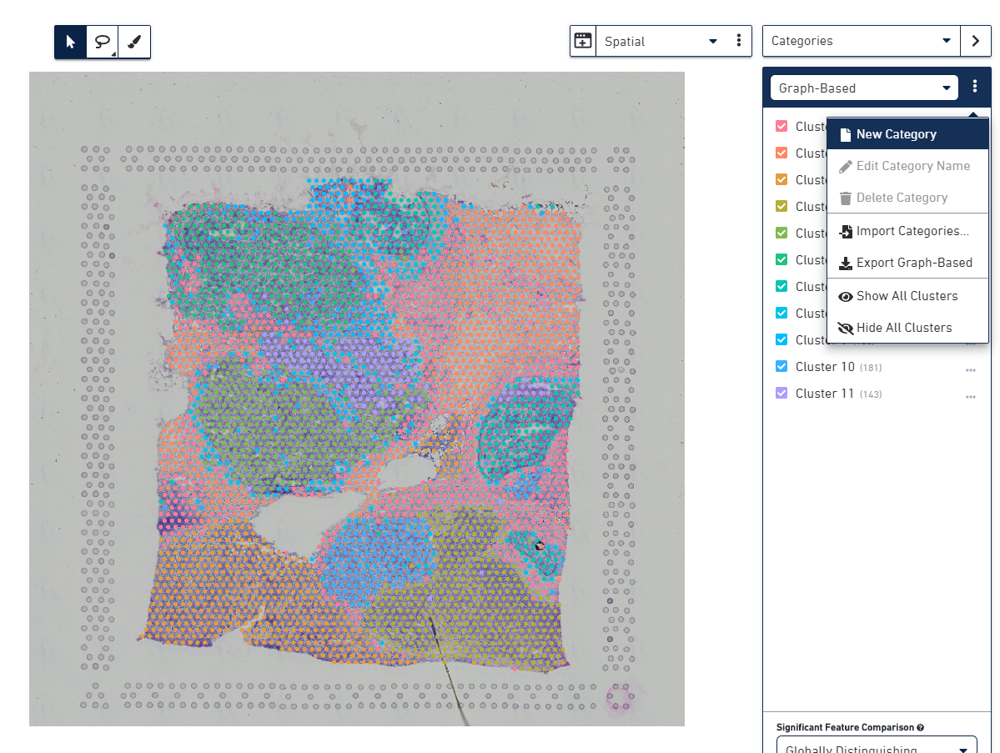

Type in "Histology" and click the green checkbox


Select the Polygonal Selection Tool at the center top.

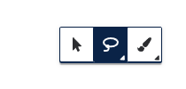

Next, left click and drag around the 12 spots at the lower right of the section.

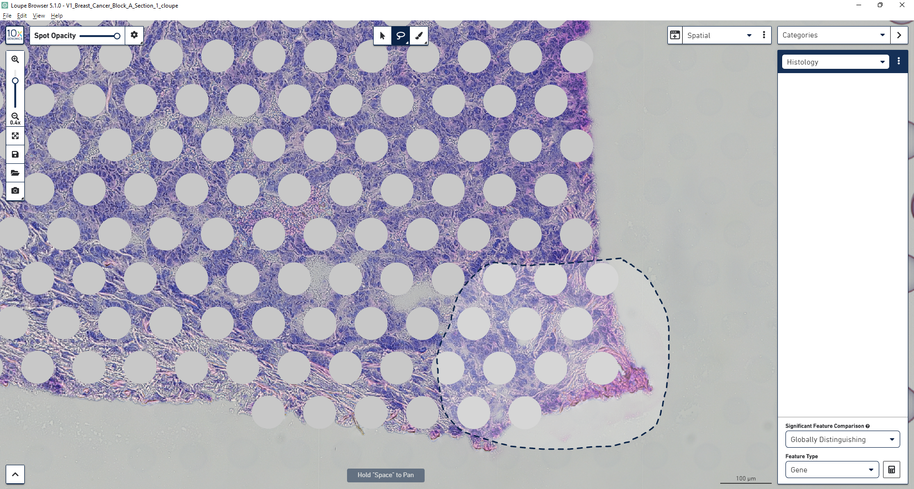

Next, left click and drag around the 12 spots at the lower right of the section.


Select "Histology" from the dropdown menu, and type in an annotation, in this example "Userguide_12", and then click "Create new cluster "Userguide_12", and then click the save button to save the annotation.

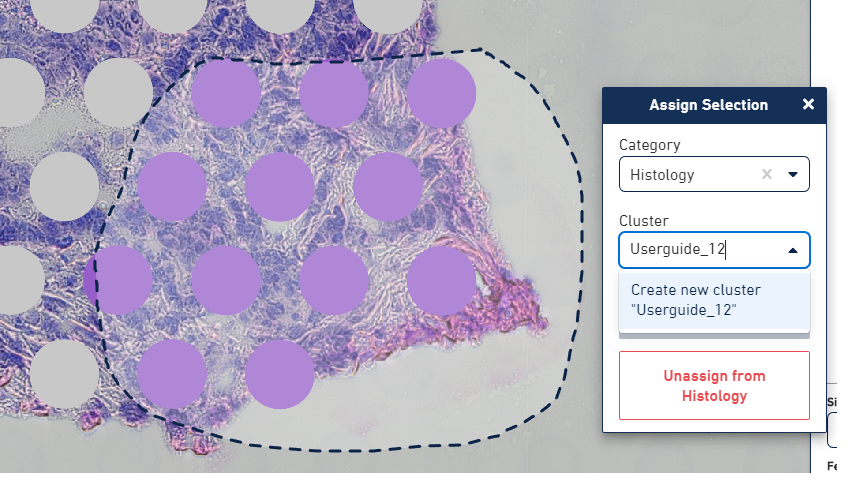

If this all was done properly, you should see the following:

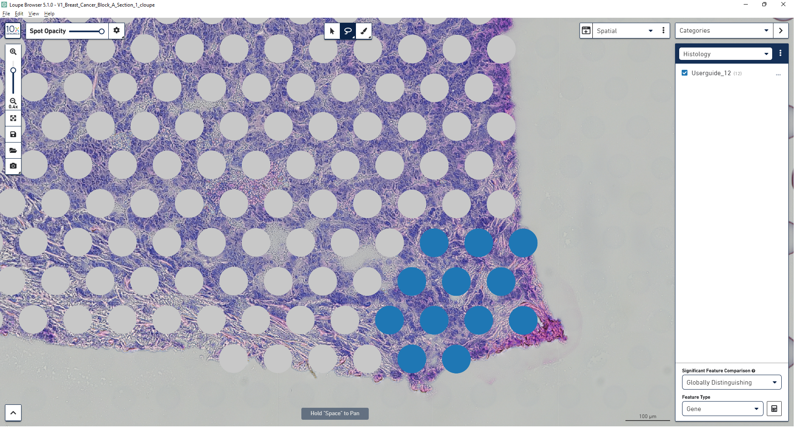

Finally, we will export the annotations. Start by selecting the 3 white dots at the upper right, and select "Export Histology" from the dropdown menu.

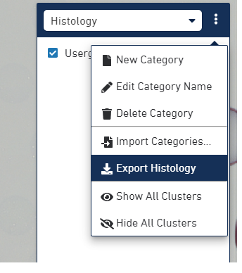

Select "Exclude Unlabeled".

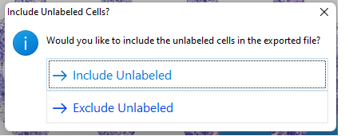

Type in "10xBreast_UserguideHistologyAnnotations.csv", and select "Export".

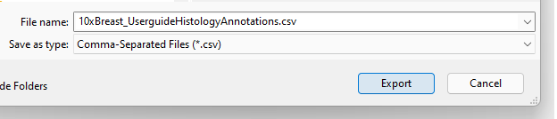

## Importing Histological Annotation Data
***

We will next import the histological annotation .csv file containing histological annotations and convert it to the R `data.frame` format. This was created in the previous step, but we also provide this .csv file in the directory if you wish to skip to this step.

The motivations for annotations is described above and in our manuscript. These annotations are typically used in analyses to subselect or filter for certain histological populations.

```{r, eval = FALSE}
# Reading the histological annotation file created above, and appending the string "Breast10X" before each barcode with ImportHistologicalAnnotations()
Userguide_10xBreast_Histology <- ImportHistologicalAnnotations("Breast10X", "./UserGuideFiles/10xBreast_UserguideHistologyAnnotations.csv")

# Showing the first part of the Userguide_10xBreast_Histology dataframe 
head(Userguide_10xBreast_Histology)
```

## Merging histological annotation data with count data 
***

This next step demonstrates functionality of `MergingCountAndAnnotationData()`. This function requires 3 parameters: a section annotation string (this needs to be identical from the annotation and count files), the annotation `data.frame`, and the count `data.frame`)

This step will also apply a QC filter, to remove any barcodes that fall below the recommended QC threshold of a minimum of 500 counts.

```{r, eval = FALSE}
# Merging annotations, and counts, and applying QC with MergingCountAndAnnotationData()
Userguide_10xBreast_Joined_Counts <- MergingCountAndAnnotationData("Breast10X",Userguide_10xBreast_Histology, Breast_ENSBMLID_Counts)

# Setting the "Genes" column as the rownames
Userguide_10xBreast_Joined_Counts <- Userguide_10xBreast_Joined_Counts %>% column_to_rownames(var = "Genes")

# Removing the pre-merged count file as it is no longer needed
rm(Breast_ENSBMLID_Counts)

# Showing the first part of the Userguide_10xBreast_Histology dataframe 
head(Userguide_10xBreast_Joined_Counts)
```

## Selecting finalized annotations for export for use in infercnv::run 
***

During pre-processing, you may filter out certain barcodes (either due to selection of certain histological populations, or due to not passing QC). The function `FinalAnnotations()` compares the processed count file (which has all of the count data to be analyzed) with the original parent histological annotation file, removes any extra annotations not included in the count file, and returns a finalized annotation dataframe for export.

In this example, we will simulate this, by dropping the first barcode from the count file processed above.

```{r, eval = FALSE}
#Diplaying the dimensions of the original annotation file: 12 rows, 2 columns
dim(Userguide_10xBreast_Histology)

#Dropping the first barcode count data
Userguide_10xBreast_Joined_Counts <- Userguide_10xBreast_Joined_Counts %>% select(-Breast10X_AATAACGTCGCGCCCA.1)

#Running FinalAnnotations() to return only the barcodes in the count file
FinalAnnotationsForExport <- FinalAnnotations(Userguide_10xBreast_Histology, Userguide_10xBreast_Joined_Counts)

#Diplaying the dimensions of the final annotation: 11 rows, 2 columns
dim(FinalAnnotationsForExport)
```

## Manual selection of output groups from a infercnv run plot for visualization and further analysis
***

In order to run the next function, we need to run infercnv. InferCNV requires 3 inputs: a count file, an annotation file, and a gene loci file. We will output the first annotation and count file created above. Documentation to create a gene loci file can be found [here at the infercnv wiki documentation](https://github.com/broadinstitute/inferCNV/wiki/instructions-create-genome-position-file). To save you time, we provide a file download in the chunk. Author Note: given that the repo is private, this is currently commented out: [manually download](https://raw.githubusercontent.com/aerickso/SpatialInferCNV/main/FigureScripts/) the siCNV_GeneOrderFile.tsv file from the repo.

```{r, eval = FALSE}
# Download the siCNV_GeneOrderFile to the local directory

# Author Note: given that the repo is private, this is currently commented out: manually download the file from the repo
#download.file("https://raw.githubusercontent.com/aerickso/SpatialInferCNV/main/FigureScripts/siCNV_GeneOrderFile.tsv?token=GHSAT0AAAAAABRUPXQSKNJYB6FRBX2GLUGMYR77RCQ", "./siCNV_GeneOrderFile.tsv", mode = "wb")

# Write the Userguide_10xBreast_Joined_Counts.tsv to the local directory
write.table(Userguide_10xBreast_Joined_Counts, "Userguide_10xBreast_Joined_Counts.tsv", sep = "\t")

# Write the Userguide_10xBreastFinalAnnotationsForExport.tsv to the local directory
write.table(FinalAnnotationsForExport, "Userguide_10xBreastFinalAnnotationsForExport.tsv", 
            sep = "\t",
            quote = FALSE, 
            col.names = FALSE, 
            row.names = FALSE)

# Create the inferCNV object from the 3 files.
Userguide_10xBreastCancer_infCNV <- infercnv::CreateInfercnvObject(raw_counts_matrix="./Userguide_10xBreast_Joined_Counts.tsv", #created above
                                               gene_order_file="./UserGuideFiles/siCNV_GeneOrderFile.tsv", #downloaded
                                               annotations_file="./Userguide_10xBreastFinalAnnotationsForExport.tsv", #created above
                                               delim="\t", #separator
                                               ref_group_names=NULL, #reference group is null as we do not have a reference group
                                               chr_exclude = c("chrM")) #run on all chromosomes except mitochondria

# Run inferCNV
Userguide_10xBreastCancer_infCNV = infercnv::run(Userguide_10xBreastCancer_infCNV, #call the infercnv object
                                              cutoff=0.1, #standard infercnv cutoff parameter (see infercnv::run documentation)
                                              out_dir="./InferCNVrun_outputs", #create a separate output folder
                                              cluster_by_groups=FALSE, #unsupervised analysis
                                              HMM = FALSE, #We dont need HMM outputs
                                              denoise=TRUE) #denoising applies noise reduction for the plot output

```
Further documentation on running infercnv [can be found here](https://github.com/broadinstitute/inferCNV/wiki/Running-InferCNV).

Within the created InferCNVrun_outputs subfolder, this is what the resultant infercnv.21_denoised.png looks like:

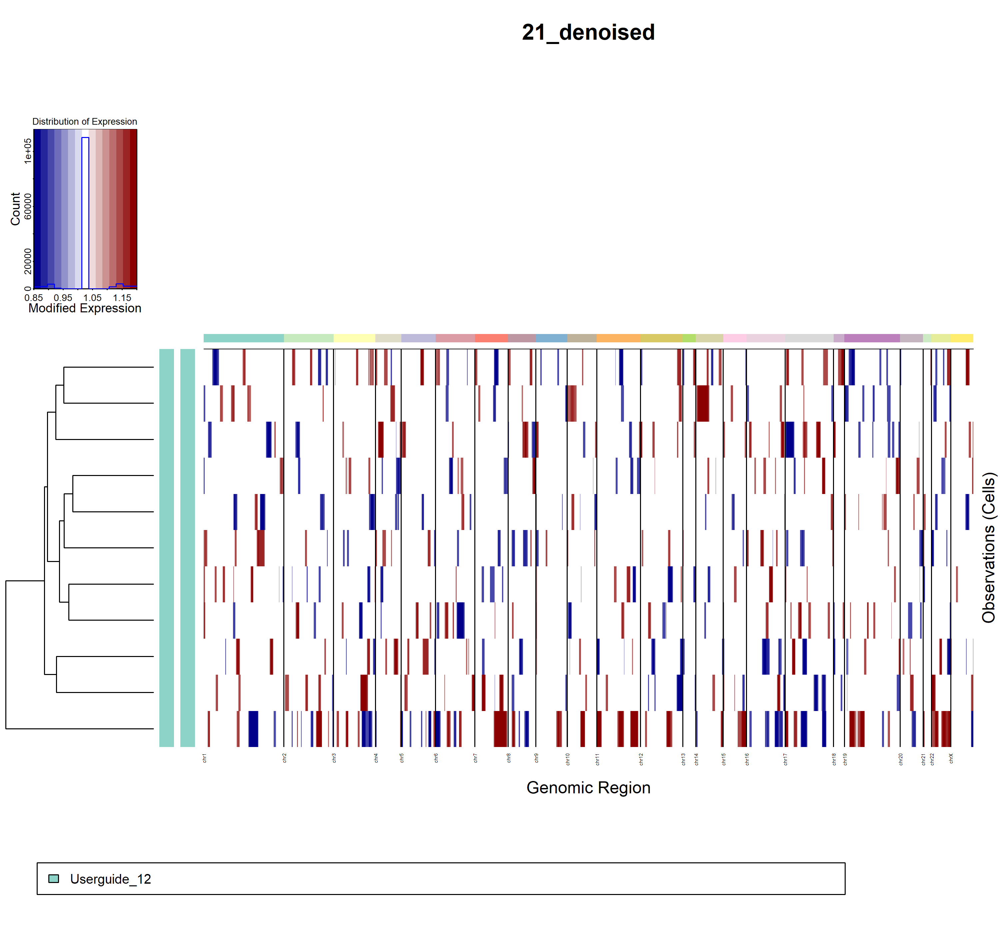 

This is where SpatialInferCNV's `SelectingSubTreeData()` function can help: it allows you to identify barcodes associated with certain clusters by manual selection from the dengrogram at left. For this The dendrogram, visualized at left in the above denoised output plot, is also generated in infercnv::run, and can be found at "./InferCNVrun_outputs/infercnv.21_denoised.observations_dendrogram.txt".

Please note: this next step requires manual interpretation of the images (often done in an image viewer or editor outside of R).

For the purposes of the userguide, lets assume that we have identified signal in certain groups of Visium spots (here termed "clones"). Lets proceed with about extracting the identities of the barcodes for clone 1, 2 and 3 highlighted in boxes the following image (edited in Microsoft Paint).

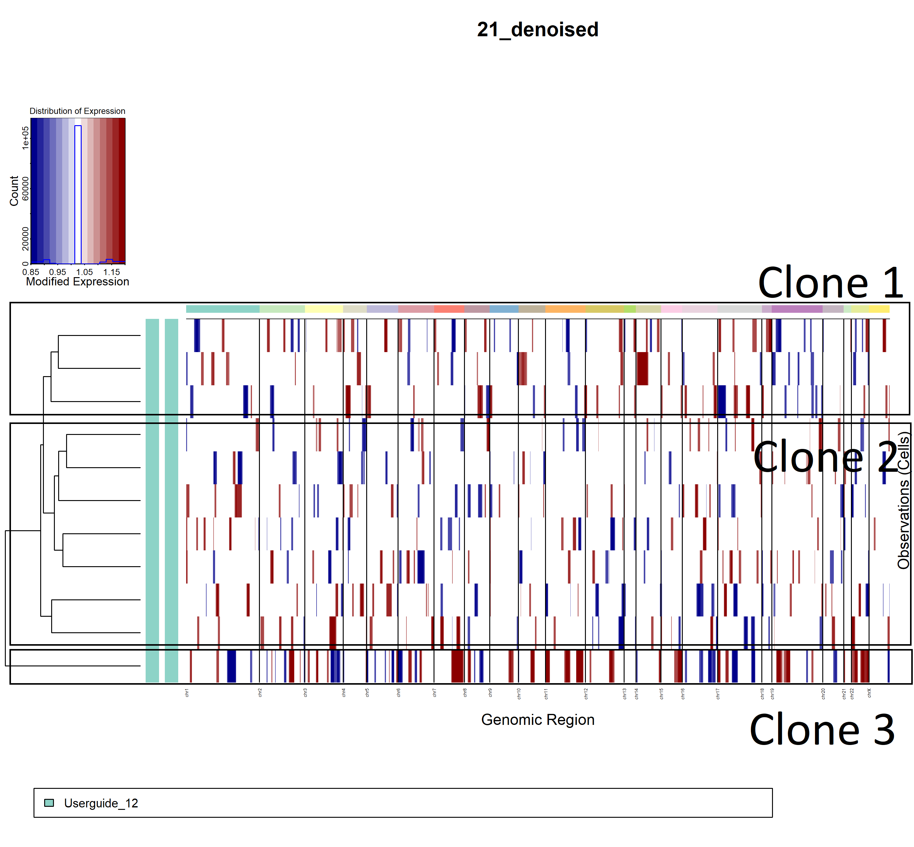 

```{r, eval = FALSE}
library(ape)
library(phylogram)

#We use read.dendrogram() to import the dendogram file
BreastCancer10x_for_clustering <- read.dendrogram(file = "./UserGuideFiles/infercnv.21_denoised.observations_dendrogram.txt")

#We convert to a phylo object using as.phylo()
BreastCancer10x_for_clustering_phylo <- as.phylo(BreastCancer10x_for_clustering)

#We then use subtrees() to enable further interaction with the dendrogram
my.subtrees = subtrees(BreastCancer10x_for_clustering_phylo)  # subtrees() to subset

#We then output an image to visualize all of the dengdrogram nodes 
png("BreastCancer10x_forclustering_phylo.png",width=10000,height=2500, res = 300)
plot(BreastCancer10x_for_clustering_phylo,show.tip.label = FALSE)
nodelabels(text=1:BreastCancer10x_for_clustering_phylo$Nnode,node=1:BreastCancer10x_for_clustering_phylo$Nnode+Ntip(BreastCancer10x_for_clustering_phylo))
dev.off()
```

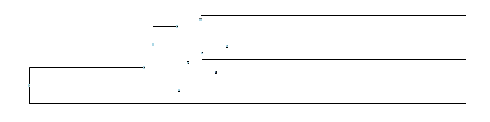

If we manually inspect the image above, we can identify the dendrogram nodes associated with the clone groups of interest.

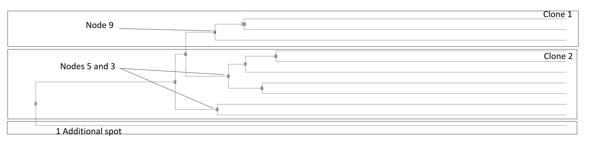
We then select these nodes data using `SelectingSubTreeData()`, with the my.subtrees object created above, and the numerical node number in the output image. The output of `SelectingSubTreeData()` is a `data.frame`, with barcodes in the first column, and the node number (identified above), in the second column.

```{r, eval = FALSE}
#Selecting Node 9
Node9 <- SelectingSubTreeData(my.subtrees, 9)

#Selecting Node 5
Node5 <- SelectingSubTreeData(my.subtrees, 5)

#Selecting Node 3
Node3 <- SelectingSubTreeData(my.subtrees, 3)

#Merging All Nodes Together
MergedNodes <- rbind(Node5, Node9)
MergedNodes <- rbind(MergedNodes, Node3)

#Note, since the "additional spot" for Clone 3 did not have a node, we will identify it by joining the original annotations to the MergedNodes dataframe
MergedNodes <- full_join(MergedNodes, FinalAnnotationsForExport)

#The additionally joined barcode does not have a node identity, so we will manually change it to "Clone 3" (in line with the image above)
MergedNodes$Node <- ifelse(is.na(MergedNodes$Node), "Clone 3", MergedNodes$Node)

#We will then drop the Histology column
MergedNodes <- MergedNodes %>% select(-Histology)

#This then renames "Node" to "Clone"
MergedNodes$Node <- ifelse(MergedNodes$Node == "Node_9", "Clone1",
                     ifelse(MergedNodes$Node == "Node_5" , "Clone2",
                     ifelse(MergedNodes$Node == "Node_3" , "Clone2", MergedNodes$Node)))

#Show the first part of the finalized dataframe for this step
head(MergedNodes)
```

The MergedNodes `data.frame` object can be used, for example, to output a new annotation file, to be imported into inferCNV, and then run inferCNV with cluster_by_groups=TRUE, to output a plot, clustered by clones. 

The identified clones now can also be visualized in the LoupeBrowser for analysis or generation of figure images. To do so, they need to be exported as a .csv file, and the "section name" that we appended to the barcodes needs to be removed.

```{r, eval = FALSE}
#Copy the MergedNodes dataframe to a new dataframe called "ForLoupeBrowser"
ForLoupeBrowser <- MergedNodes

#Use the function substr() to remove the first 9 characters in the barcode column (removes "Breast10X_")
ForLoupeBrowser$Barcode <- trimws(substr(ForLoupeBrowser$Barcode, 11, 100))

#Replace the "." in the current barcode dataframe to "-" (required for LoupeBrowser)
ForLoupeBrowser$Barcode <- gsub("\\.", "\\-", ForLoupeBrowser$Barcode)

#Write the dataframe to csv
write.csv(ForLoupeBrowser, "Userguide_BreastCancer_Clones_ForLoupeBrowser.csv", row.names = FALSE)
```

Open the .cloupe file that was downloaded earlier. Select the 3 white dots at the right, and select "Import Categories..."

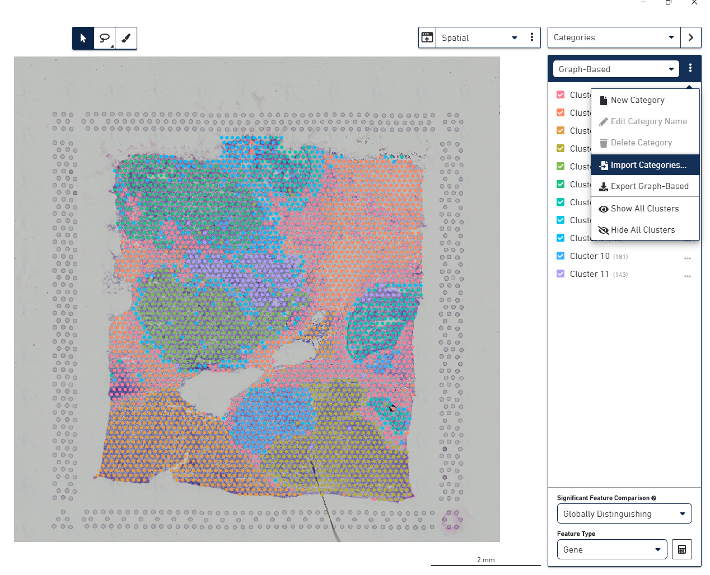

Select the Userguide_BreastCancer_Clones_ForLoupeBrowser.csv created above, and click "Import Categories..."

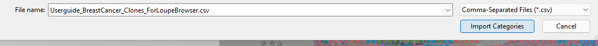

The spots should be now visualized with the clone identity labeled.

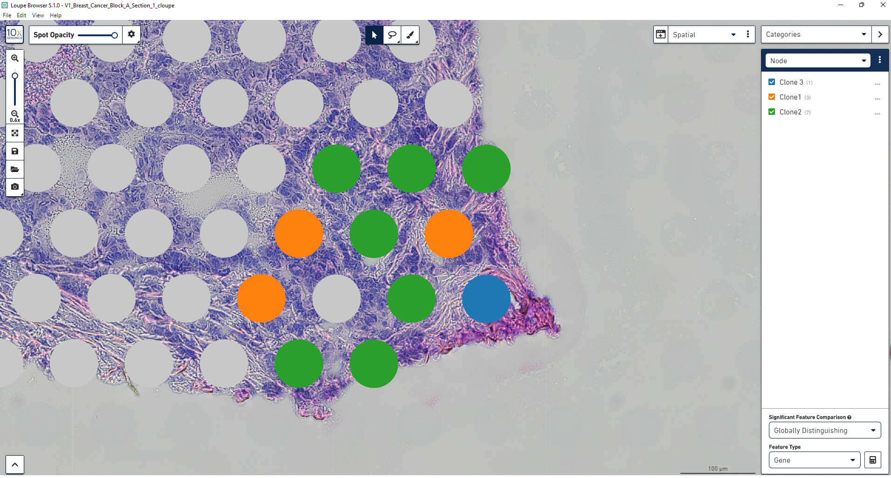

## Working with 1k array spatial array ST 
***

SpatialInferCNV functions also work with [1K array ST data](https://www.science.org/doi/10.1126/science.aaf2403). This is functionally similar to the above `ImportCountData()`, but instead ImportOriginalSTCountData imports count data in .tsv format, appends a section identifier to the barcodes, and returns an R `data.frame`.

We will download data from this publicly available [BreastCancer](https://data.mendeley.com/datasets/29ntw7sh4r/2) 1k array spatial transcriptomics dataset.

```{r, eval = FALSE}
#Downloading the files from the published Mendeley
download.file("https://data.mendeley.com/public-files/datasets/29ntw7sh4r/files/cbf4607b-1b8f-4b23-9a7e-27f94bdfd0fc/file_downloaded", "./BC23209_C1_stdata.tsv.gz", mode = "wb")

#Importing counts from the downloaded .gz file
BC23209_C1_counts <- ImportOriginalSTCountData("BC23209_C1", "./BC23209_C1_stdata.tsv.gz")

#Displaying first part of the dataframe
head(BC23209_C1_counts)
```

## Import histological selections 
***

The [STPipeline](https://github.com/SpatialTranscriptomicsResearch/st_pipeline) outputs a spot_data-selection.tsv file, which is used to identify which spots actually had tissue covering them. This step is automatically performed in the SpaceRanger pipeline, so is not needed for Visium data.

The [Mendeley data repository](https://data.mendeley.com/datasets/29ntw7sh4r/2) also provides the spot selection file.

```{r, eval = FALSE}
#Downloading the files from the published Mendeley
download.file("https://data.mendeley.com/public-files/datasets/29ntw7sh4r/files/01568b4e-950d-4bcd-9a01-cd509e557625/file_downloaded", "./spots_BC23209_C1.csv.gz", mode = "wb")

#Importing the downloaded spot selection .csv file
CSV <- read.csv("./spots_BC23209_C1.csv.gz")

#The file is slightly different than the STPipeline spot_data-selection_aligned.tsv file structure, which has explicit "x" and "y"
CSV <- CSV %>% separate(X.1, into = c('x', 'y'), sep = "x")

#Writing the Dataframe to .tsv (to mirror the actual STPipeline output)
write.table(CSV, "spots_BC23209_C1.tsv", 
                              sep = "\t",
                              quote = FALSE,
                              row.names = FALSE)
rm(CSV)

#Read in the selected barcodes and appending the section name
BC23209_C1_SelectedBarcodes <- ImportHistologicalOriginalSTSelections("BC23209_C1", "./spots_BC23209_C1.tsv")
#rewrite for X and Y

#Displaying first part of the dataframe
head(BC23209_C1_SelectedBarcodes)
```

## Merging 1k array histological annotation data with count data
***

In this chunk, we will subselect 10 spots at random from the selected barcodes, append an annotation for these 10 spots, and then run `OriginalST_MergingCountAndAnnotationData()` to select count data only from these 10 spots. This function also passes a QC check. This function is similar to `MergingCountAndAnnotationData()` ran above on Visium Data


```{r, eval = FALSE}
#Select the first 10 barcodes and rename the first column back to barcode
BC23209_C1_SelectedBarcodes <- as.data.frame(BC23209_C1_SelectedBarcodes[1:10,])
names(BC23209_C1_SelectedBarcodes)[1] <- "Barcode"

#Add a second column to the selected barcodes dataframe called "Histology", which will title BC23209_Random10
BC23209_C1_SelectedBarcodes <- BC23209_C1_SelectedBarcodes %>% 
                  select(Barcode) %>%
                  mutate(Histology = "BC23209_Random10")

#Finally, then subselecting the count data for only the BC23209_Random10 spots
BC23209_C1_JoinedCounts <- OriginalST_MergingCountAndAnnotationData(BC23209_C1_SelectedBarcodes, BC23209_C1_counts)

# Setting the "Genes" column as the rownames
BC23209_C1_JoinedCounts <- BC23209_C1_JoinedCounts %>% column_to_rownames(var = "Genes")

#Displaying first part of this dataframe
head(BC23209_C1_JoinedCounts)
```

## Spatial Visualization of Original ST Data - Using publicly available Breast Cancer Data
***

SpatialInferCNV provides functions to visualize the number of genes with an inferred copy number alteration (as presented in Figure 1 of our manuscript). We will need to generate the 1k array, spot level inferCNV HMM results.


In order to run the next function, we need to run infercnv. InferCNV requires 3 inputs: a count file, an annotation file, and a gene loci file. We will output the first annotation and count file created above. Documentation to create a gene loci file can be found [here at the infercnv wiki documentation](https://github.com/broadinstitute/inferCNV/wiki/instructions-create-genome-position-file). To save you time, we provide a file download in the chunk. Author Note: given that the repo is private, this is currently commented out: [manually download](https://raw.githubusercontent.com/aerickso/SpatialInferCNV/main/FigureScripts/) the siCNV_GeneOrderFile.tsv file from the repo.

```{r, eval = FALSE}
# Download the siCNV_GeneOrderFile to the local directory

# Author Note: given that the repo is private, this is currently commented out: manually download the file from the repo
#download.file("https://raw.githubusercontent.com/aerickso/SpatialInferCNV/main/FigureScripts/siCNV_GeneOrderFile.tsv?token=GHSAT0AAAAAABRUPXQSKNJYB6FRBX2GLUGMYR77RCQ", "./siCNV_GeneOrderFile.tsv", mode = "wb")

# Write the Userguide_10xBreast_Joined_Counts.tsv to the local directory
write.table(BC23209_C1_JoinedCounts, "BC23209_C1_JoinedCounts.tsv", sep = "\t")

#One spot was filtered from the count array by the QC step, so extract the final barcodes for
FinalAnnotationsForExport1karray <- FinalAnnotations(BC23209_C1_SelectedBarcodes, BC23209_C1_JoinedCounts)

# Write the Userguide_10xBreastFinalAnnotationsForExport.tsv to the local directory
write.table(FinalAnnotationsForExport1karray, "BC23209_C1_SelectedBarcodes.tsv", 
            sep = "\t",
            quote = FALSE, 
            col.names = FALSE, 
            row.names = FALSE)

# Create the inferCNV object from the 3 files.
Userguide_1kArrayBreastCancer_infCNV <- infercnv::CreateInfercnvObject(raw_counts_matrix="./BC23209_C1_JoinedCounts.tsv", #created above
                                               gene_order_file="./UserGuideFiles/siCNV_GeneOrderFile.tsv", #downloaded
                                               annotations_file="./BC23209_C1_SelectedBarcodes.tsv", #created above
                                               delim="\t", #separator
                                               ref_group_names=NULL, #reference group is null as we do not have a reference group
                                               chr_exclude = c("chrM")) #run on all chromosomes except mitochondria

# Run inferCNV
Userguide_1kArrayBreastCancer_infCNV = infercnv::run(Userguide_1kArrayBreastCancer_infCNV, #call the infercnv object
                                              cutoff=0.1, #standard infercnv cutoff parameter (see infercnv::run documentation)
                                              out_dir="./InferCNVrun_outputs_1karray", #create a separate output folder
                                              cluster_by_groups=TRUE, #We want to run the analysis by spot, so need this parameter = TRUE
                                              denoise=TRUE, # denoising applies noise reduction for the plot output
                                              HMM=TRUE, #We need the HMM data for the visualization
                                              analysis_mode = "cells", #We want to run the analysis by spot (inferCNV was designed for scRNAseq)
                                              HMM_report_by = "cell") #we need to set the HMM report to output by cell 

```

Having then run inferCNV and obtained HMM outputs, we then need to further format the data prior to using the functions for 1k array visualization

```{r, eval = FALSE}
#initializing additional libraries
library(reshape2)
library(grid)
library(svglite)

#We want a dataframe of all possible barcodes, not just the 10 random sections with HMM data
AllBarcodes <- ImportHistologicalOriginalSTSelections("BC23209_C1", "./spots_BC23209_C1.tsv")
names(AllBarcodes)[1] <- "Barcode"
AllBarcodes$Histology <- "AllBarcodes"

#WGSize <-  3049315783

#We also want a dataframe of all possible barcodes in a 1k array assay. We use the original barcode file provided by SpatialTranscriptomicsResearch
L2_Barcodes <- read.table("https://github.com/SpatialTranscriptomicsResearch/st_pipeline/raw/master/ids/1000L2_barcodes.txt", sep = "\t")
names(L2_Barcodes)[1] <- "Barcode"
names(L2_Barcodes)[2] <- "X"
names(L2_Barcodes)[3] <- "Y"
L2_Barcodes$ModfiedBarcode <- paste0(L2_Barcodes$X, "x", L2_Barcodes$Y)
L2_Barcodes <- L2_Barcodes %>% 
      select(ModfiedBarcode)
names(L2_Barcodes)[1] <- "Barcode"


#We then use the first threshold to optimize signal-to-noise for spatial visualization across all genes with an inferred CNV, all genes genes with an inferred CNV (for this dataset, 35%).

#Uncomment, and use this line if you want to use the file you generated above
#CNV_Genes_Userguide <- read.delim("./InferCNVrun_outputs_1karray/17_HMM_predHMMi6.hmm_mode-cells.pred_cnv_genes.dat")

#Use this comment if you want to use the file that we have provided 
CNV_Genes_Userguide <- read.delim("./UserGuideFiles/17_HMM_predHMMi6.hmm_mode-cells.pred_cnv_genes.dat")

#Adding section name as a column
CNV_Genes_Userguide <- CNV_Genes_Userguide %>% mutate(section = substr(cell_group_name, 1, 10))

#Displaying the first part of this dataframe 
head(CNV_Genes_Userguide)

```

## Extracting sectionwise, spot level HMM data 
***

`ExtractSectionWise()` is designed to extract specific section, spot level HMM data: while not relevant for the userguide as we are using data from only 1 section, this is useful in the modified output HMM `data.frame`s containing multiple sections data.

Having now obtained the necessary inputs, we can run `ExtractSectionWise()`.

```{r, eval = FALSE}
BC23209_C1_Sectionwise_CNVsGenes_Counted <- ExtractSectionWise("BC23209_C1", #The section name
                                                               CNV_Genes_Userguide, #The HMM dataframe file that we modified to add "section" above
                                                               AllBarcodes, #All barcodes that had tissue (imported above)
                                                               0.45) #A threshold, to filter only for HMMs that are detected in 45 percent of spots with HMM data
```

## Creating a visualization matrix for the HMM 1k array data 
***
Using the output from `ExtractSectionWise()`, we can then create a matrix for spatially plotting the 1k array data with `Output_PGA_Visualization_MatrixGreyNA()`.

```{r, eval = FALSE}
PGA_Matrix <- Output_PGA_Visualization_MatrixGreyNA("BC23209_C1", #The section name
                                                    BC23209_C1_Sectionwise_CNVsGenes_Counted, #The output from ExtractSectionWise() above
                                                    L2_Barcodes) #All barcodes in the 1k array, used to generate the matrix for the plot
```

## Plot PGA 
***
Using the output from `Output_PGA_Visualization_MatrixGreyNA()`, we can finall apatially plotting the 1k array data with `Plot_PGA_Visualization_Matrix()`.

```{r, eval = FALSE}
#Defining Max Value, this is more relevant when working with multiple sections
BC23209_C1Max <- as.numeric(max(BC23209_C1_Sectionwise_CNVsGenes_Counted$PercentageGenomeAltered))
MaxVal<- max(BC23209_C1Max)

#Plotting the visualization
Plot_PGA_Visualization_Matrix("BC23209_C1", PGA_Matrix, MaxVal)

#Saving the plot with ggsave
ggsave(paste0("BC23209_C1", "_", "PGA_SpatialVisualization_", Sys.Date(), ".png"),
         plot = last_plot() + labs(x=NULL, y=NULL),
         device = NULL,
         path = NULL,
         scale = 1,
         width = NA,
         height = NA,
         dpi = 300,
         limitsize = TRUE)
```
The spots should be now visualized with the clone identity labeled.


